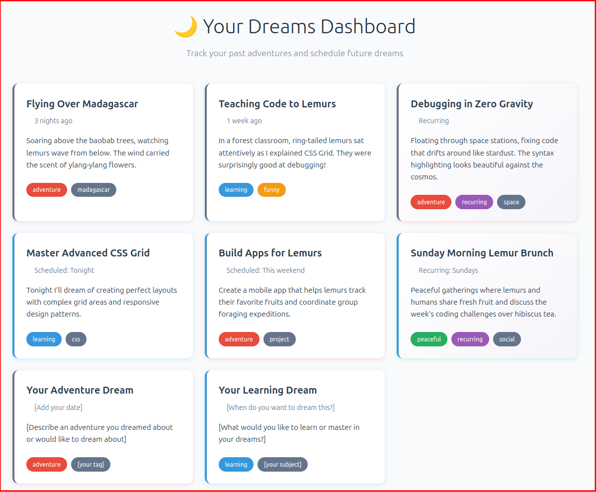

# Dreams Dashboard - CSS Transitions Follow-up Lab

🌙 **Build your personal dreams tracking interface while mastering CSS fundamentals!**

Welcome to your follow-up transitions lab! Instead of separate playgrounds, you'll progressively build one cohesive dreams dashboard that integrates the core CSS concepts you've been learning: Grid, Flexbox, Box Model, Typography, and the Cascade.



## 🚀 Getting Started

1. **Open the project**: Start by opening `index.html` in your browser
2. **Explore the HTML**: Open `index.html` in your code editor and look at the dream cards structure - you'll customize these!
3. **Open the CSS**: Follow along in `css/styles.css` where you'll work
4. **Work through phases**: Each phase builds on the previous one

## 🏗️ Lab Structure: Progressive Build

Instead of separate playgrounds, you'll build one interface through 3 focused phases:

### Phase 1: Foundation & Grid Layout (25 minutes)

**Learning Focus**: Project structure, CSS Grid, Box Model integration

- Understand how HTML and CSS files work together
- Create a responsive grid layout for dream cards
- Apply box model principles for proper spacing
- Add visual indicators for different dream types

### Phase 2: Content Layout & Typography (30 minutes)

**Learning Focus**: Flexbox, Typography hierarchy, Advanced selectors

- Structure the internal layout of each dream card
- Create clear typography relationships
- Style dream tags and metadata
- Apply the cascade to create consistent but varied styling

### Phase 3: Interactive States & Transitions (35 minutes)

**Learning Focus**: State management, Smooth transitions, User experience

- Add hover and focus states that reveal card details
- Create smooth transitions between different states
- Implement filter/category interactions
- Understand how transitions work with layout changes

## 🎨 Customization Opportunities

Throughout the lab, you'll have chances to make it truly yours:

- **Replace placeholder dreams** with your own dreams and goals
- **Choose colors** that match how different dreams feel to you
- **Adjust transitions** - should peaceful dreams move slowly or quickly?
- **Experiment with layouts** - find the grid and spacing that feels right

## 📂 Project Structure

```
dreams-dashboard/
├── index.html          # Your dreams content (customize the placeholder dreams!)
├── css/
│   └── styles.css      # Your styling workspace (organized by phases)
└── README.md           # This file
```

**Key Insight**: The browser reads your HTML, sees the `<link>` tag, fetches your CSS, and combines them to create the visual result you see.

## 🔧 Getting Unstuck

### If your layout looks broken:

1. **Check the browser console** (Right-click → Inspect → Console) for CSS errors
2. **Verify CSS syntax** - missing semicolons and typos are common
3. **Use browser dev tools** - Right-click on elements to inspect their styles
4. **Try one change at a time** - comment out recent changes to isolate issues

### If transitions aren't working:

1. **Transition goes on the base element**, not the `:hover` state
2. **Check property names** - `background-color` not `background`
3. **Verify the trigger** - are you hovering the right element?
4. **Test without transitions first** - make sure the property change works

### If you're confused about concepts:

1. **Read the explanatory comments** - they contain key insights about how CSS systems work together
2. **Experiment with individual properties** - comment out other styles to isolate effects
3. **Use your browser's responsive design mode** - see how your grid adapts to different sizes

## ⏱️ Time Breakdown

- **Phase 1 (Foundation)**: 25 minutes - Grid, box model, project understanding
- **Phase 2 (Content Layout)**: 30 minutes - Flexbox, typography, cascade
- **Phase 3 (Interactions)**: 35 minutes - Transitions, states, polish

**Total**: ~90 minutes including experimentation and customization

## 🚀 Extension Ideas

If you finish early or want to keep exploring:

- Add more dream categories with custom styling
- Create a "dream intensity" indicator using different card heights
- Experiment with CSS animations for dream tags
- Add a dark/light theme toggle using CSS custom properties
- Try different grid layouts for different screen sizes

---

Enjoy building your dream world! 🌙✨
